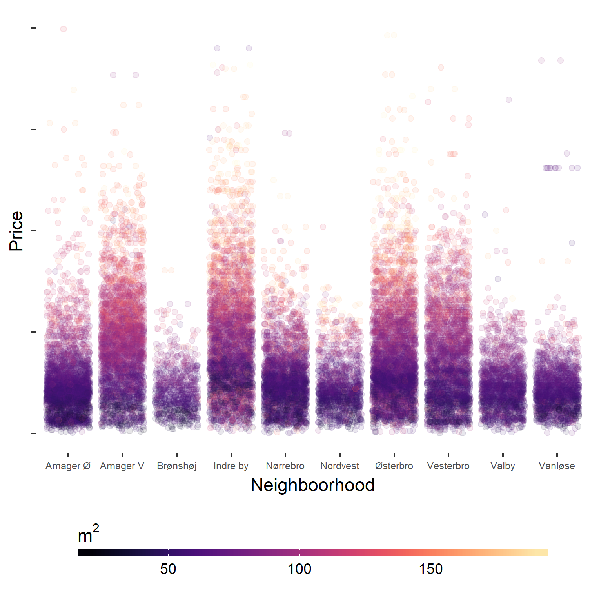

## Scraping and analysing the housing market of Copenhagen

The `Rscript.R` file contains most of the work, with a number of functions being defined in `functions.R`. appart from that any `.R` files aren't really essential to anything you see below. I scrape the danish online housing marketplace [boliga](boliga.dk) for hitorical trade price data. Please note that in the below figures data are truncated as I see fit - mainly because outliers would otherwise affect the color scales.

The data covers the whole municipality of Copenhagen, but excludes Frederiksberg:

The oldest data are from around 1992, and will (sort of) be downloaded with the oldest observations first

To dig slightly deeper into the data, let's plot price and size of the apartments by neighborhood in a neat way

And in a similar way let's try and uncover how the city has evolved

We can try different models on the data, to see if we can predict the housing prices. First actual vs. fitted values

And residuals in a similar way

Taking a raw average of the residuals from each of our models, and coloring the average values red shows how this might enhance precision and we can understand why this might help reduce variance.

## Usage
This project relies on a number of very large data files, including a national adress registry and a city shapefile - to get access to these you can contact me directly, as storing them on github would take upto much space.
